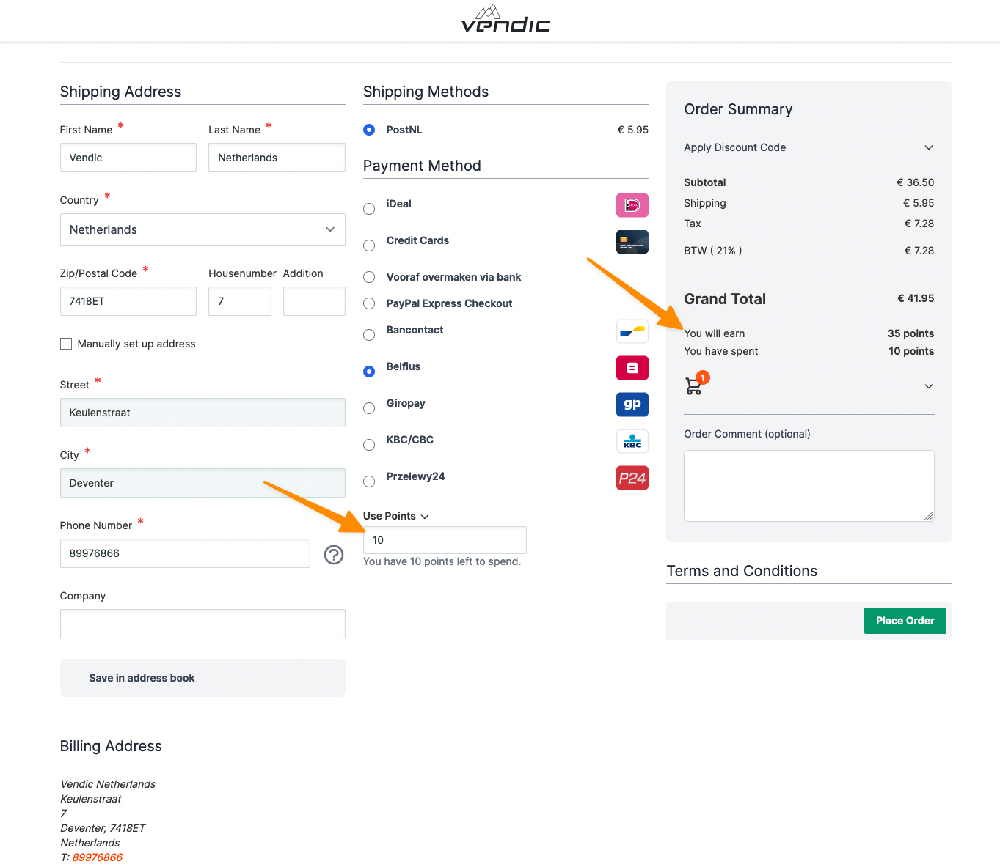

# Hyvä checkout compatibility module for Mirasvit Rewards

This module makes the [Mirasvit Rewards](https://mirasvit.com/magento-2-extensions/reward-points-referral-program.html) module compatible with the [Hyva Checkout](https://www.hyva.io/hyva-checkout.html) module using [Magewire](https://github.com/magewirephp/magewire), AlpineJS and TailwindCSS. Everything can be configured as usual in the config of the Mirasvit Rewards module.

Translations are in the i18n folder. As of now, only the Dutch translations are available. Feel free to add your own translations.

## Screenshots


## Installation

```bash
composer require vendic/hyva-checkout-mirasvit-rewards
```

## Configuration

None at this moment. Feel free to create a pull request if you need specific settings. Check the [issues](https://github.com/Vendic/hyva-checkout-mirasvit-rewards/issues) for tickets that need help.

## Compatibility

- [Hyvä Themes](https://www.hyva.io/hyva-themes-license.html) ^1.0
- [Hyva Checkout](https://www.hyva.io/hyva-checkout.html) ^1.1
- [Mirasvit Rewards](https://mirasvit.com/magento-2-extensions/rewards-points-suite.html) ^3.1
- Magento 2 or [Mage-OS](https://mage-os.org/) ^2.4.4

## License
[MIT](https://github.com/Vendic/hyva-checkout-mirasvit-rewards/blob/main/LICENSE)

## Authors
- [Zaahed Yaqubi](https://vendic.nl/)

